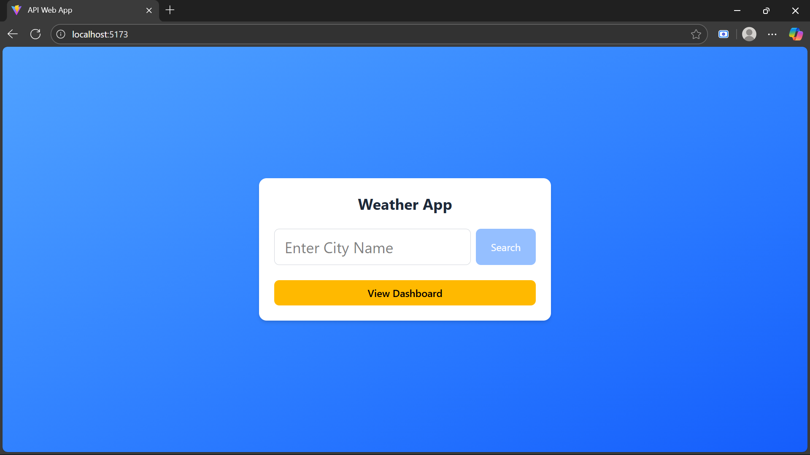
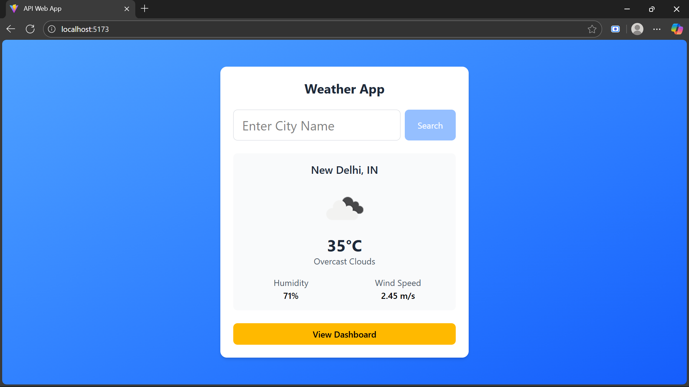
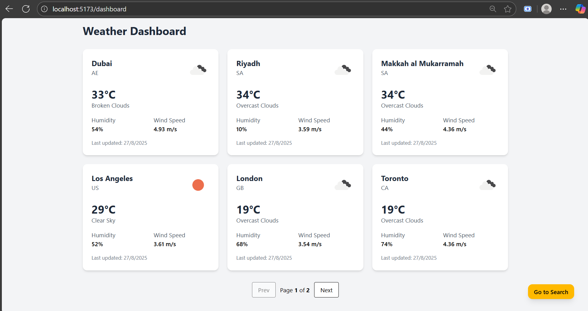

# Weather App

A **Full-Stack Weather App** built with **React (Vite)** for the frontend and **Express + MongoDB** for the backend. The app fetches real-time weather data using the **OpenWeather API**.

---

## Features

- Search weather by city name
- Fetches data from OpenWeather API
- Backend proxy (Node.js/Express) to hide API key
- Responsive UI styled with TailwindCSS
- Navigation between SearchWeather and Dashboard pages

---

## Tech Stack

- **Frontend:** React, Vite, TailwindCSS, React Router
- **Backend:** Node.js, Express, Axios
- **API:** OpenWeather API

---

## Project Structure

API-WEB-APP/
├── backend/
│ ├── config/
│ │ └── db.js # MongoDB connection setup
│ ├── controller/
│ │ └── weatherController.js # Business logic for API routes
│ ├── models/
│ │ └── Weather.js # Mongoose schema and model
│ ├── .env # Environment variables (API keys, DB URI, PORT)
│ └── server.js # Express server entry point
├── frontend/
│ ├── src/
│ │ ├── components/
│ │ │ ├── DashBoard.jsx # Page to display search history
│ │ │ ├── SearchWeather.jsx # Main page to search for a city
│ │ │ └── WeatherCard.jsx # Reusable component for weather data
│ │ ├── App.jsx # Main app component with routing
│ │ └── main.jsx # React application entry point
│ ├── package.json
│ └── vite.config.js # Vite configuration
└── README.md

---

## Setup Instructions

### 1. Clone the repo

```bash
git clone https://github.com/<your-username>/api-web-app.git
cd api-web-app
```

### 2. Install dependencies

- Frontend

```bash
cd frontend
npm install
```

- Backend

```bash
cd ../backend
npm install
```

### 3. Add Environment Variables

In `backend/.env` file:

    PORT=5000
    MONGO_URI=your_mongodb_uri
    OPENWEATHER_API_KEY=your_api_key_here

### 4. Run the backend

```bash
cd backend
npm start
```

### 5. Run the frontend

```bash
cd ../frontend
npm run dev


cd ../frontend
npm install
npm run dev
```

Now open `http://localhost:5173` in your browser

---

## Screenshots







---

## Author

- Developed by Ahmed
  LinkedIn: https://www.linkedin.com/in/habeeb-ahmed-shuaib-1b96a3228/
  GitHub: https://github.com/ahmxd18
